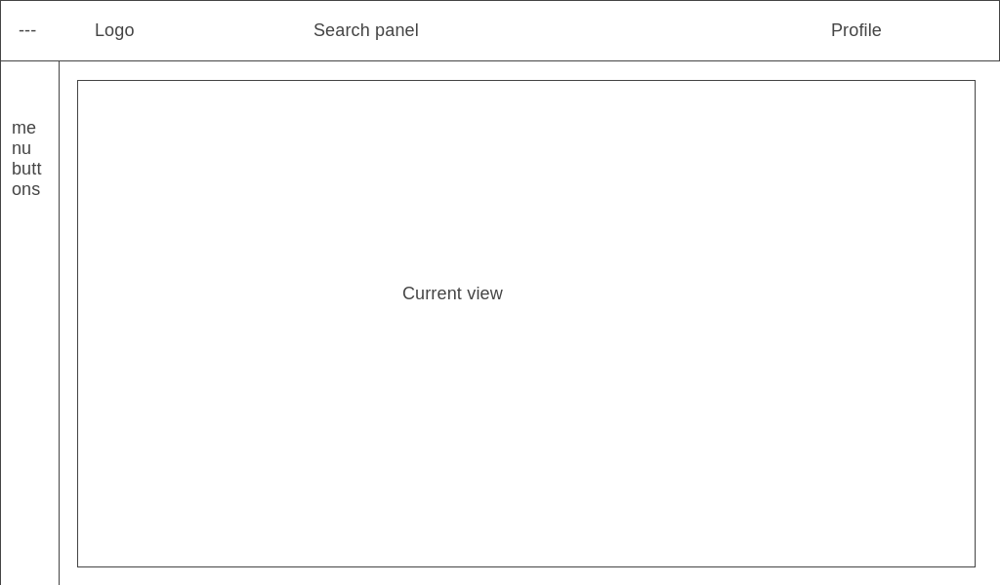

# Carrot: Design document
## Goals & Vision
Create todo list complying and extending personal experience on task management
and implementing best from Maxim Dorofeev's Jedi Techniques.

By building this application i'm solving these problems:
1. Minimalistic and simple todo app with only required functions. Available
   market todo apps have too many redundant functionality
2. There is only one app i know making some steps to implement Jedi Techniques:
   Singularity app. But, again, not everything suitable there (see problem #1)
3. No app implements my vision on task management, which i hope i can implement
   in my application

In terms of audience, i'm considering only myself, all new features will be
analyzed in first order through my experience, but i will appreciate adding
extensions for those who interested in adopting the application for themselves.

Product will be successful only if i will make usage of it on regular basis
for my personal projects and tasks.

This is app is software under free-licence that everyone can deploy on own
machine and use. Contributing / Making open-source extensions to reach
desirable functionality is appreciated.

## Requirements / System overview
### User requirements
1. As a user, i want to conveniently manage my tasks, projects and ideas, so
   that i can effectively manage Jedi's instances in one place
2. As a user, i want to have only required for me set of functionality, so
   that i can be more focused on completing my tasks, rather than playing
   with features.
3. As a user, i want to have access to core features / extensions that suits my
   needs, e.g. Jedi's `task ages`, so that i can implement my own vision to
   task management in the app

### Functional requirements
1. Minimal instance set: `Task`, `Project`
2. Minimal functionality to operate with each instance of minimal instance set:
   CRUD, set dates (good reference of dynamic setting is Todoist [2]),
   reference each other, e.g. Add task to the Project.
3. Two-way synchronization with Google Calendar for instance `Task`
5. Two-way synchronization with telegram bot (for the first time Therminbot) to
   overview and modify app's instances
6. App should be hosted on web
7. App should have descriptive (OpenAPI) API specification
8. App should have functionality to implement and add own extensions
9. Main language: English. Other languages added by extensions
10. Projects contains Tasks. Subprojects aren't allowed
11. Subtasks aren't allowed
12. Task could not have a parent Project directly
13. Unassigned to Project's Tasks resides in meta-project called
   `Unassigned`
14. In future, there is a possibility to add new instance: `Event`

## User interface

## Milestones
No time limitations and milestones for this pet-project.

## References
1. [Design document structure example](https://blog.tara.ai/software-design-documents-template/)
2. [Todoist](https://todoist.com)
3. [Google Keep](https://keep.google.com)
